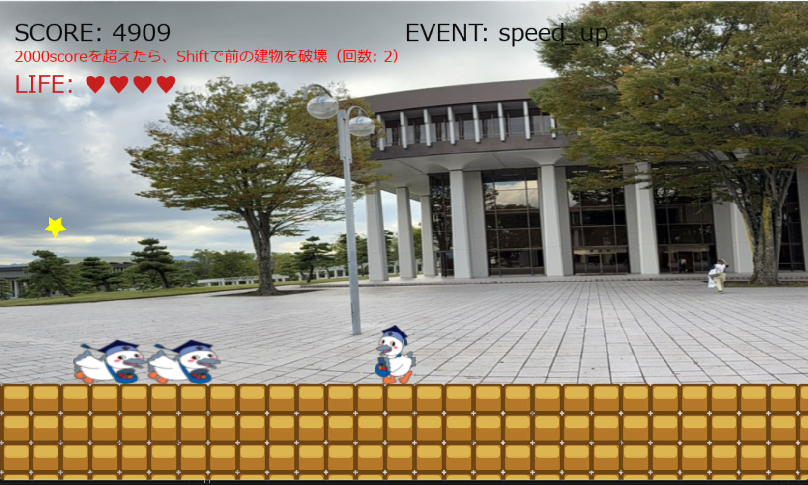

# Super こうかとん Run
* 

## 実行環境の必要条件
* python >= 3.10
* pygame >= 2.1

## ゲームの概要
* 走れこうかとん：流れてくる障害物をキーボード操作でこうかとんがよけゴールを目指すゲーム(マリオのパロディ)
* 参考URL：[サイトタイトル](https://www.nintendo.com/jp/famicom/software/smb1/index.html)

## ゲームの遊び方
* ジャンプ：
  * Space キー または ↑ キー
* 障害物を破壊（シフトアタック）：
  * Shift キー（左シフト）
* 床の色を変える：
  * M キー
* ゲーム終了：
  * ESC キーで即終了

## ゲームの実装
### 共通基本機能
* (main)    ジャンプ
* (main)    制限時間を設ける

### 分担追加機能
* main 機能（担当：白山 将、伊東 禎喜）
  * BGM
  * 背景が動く
  * スコア
* color            機能（担当：伊東 禎喜）
  * タイルの色変更
* item 機能（担当： 李　昊珈）
  * アイテム
  * 障害物を壊す
* life 機能（担当：渡辺 大樹）
  * ライフ制度
  * ライフ回復チャンス
* event 機能（担当：阿部 健人）:40秒ごとにランダムにイベントが発生し発生したイベントは10秒間継続する、イベントの内容は加速と減速の2種類であり加速は1.5倍速になり減速は0.8倍速になる。
* score 機能（担当：中野 太陽）
  * 障害物を壊すと追加ポイント
  * 特定のスコアを超えると仲間が増える

### ToDo
- [ ] ワープ
### メモ
*